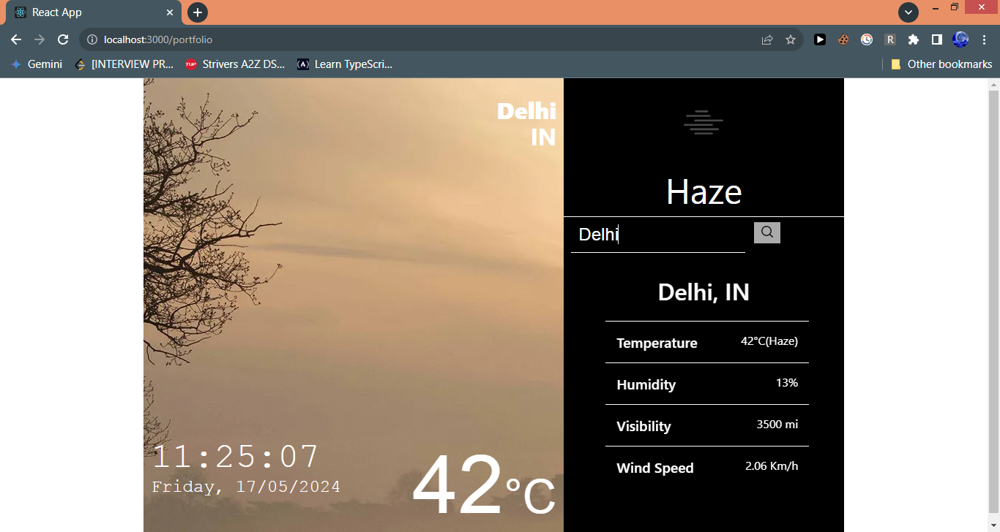

**Project Name:** Weather App

**Description:**

This React application provides a user-friendly interface to retrieve real-time weather information from OpenWeatherMap API. Users can conveniently view weather details for any location, including:

* Temperature (°C)
* Feels Like (°C) [Optional, based on API availability]
* Humidity (%)
* Visibility (km)
* Wind Speed (km/h)

Weather conditions are visually represented using a combination of:

* **Descriptive text:** Clear, Cloud, Drizzle, Haze, Rain, Smoke, Snow, Thunderstorm
* **Thematic icons:** Provided by OpenWeatherMap API
* **Background images:** Sourced from the internet to enhance the visual experience

**Screenshots**




**Key Features:**

* **Intuitive UI:** Clean and straightforward design for easy access to weather data.
* **Location Search:** Users can specify a location by city name or postal code.
* **Up-to-date Information:** Leverages OpenWeatherMap API for reliable weather data.
* **Dynamic Weather Icons:** API-provided icons depict current weather conditions.
* **Immersive Backgrounds:** Internet-sourced images create a visually engaging weather representation.

**Technologies Used:**

* React: JavaScript library for building user interfaces.
* OpenWeatherMap API: Provides real-time weather data.

**Installation:**

1. **Clone the Repository:**
   ```bash
   git clone https://github.com/akhtarmdsaad/react-weatherapp.git
   ```
2. **Install Dependencies:**
   Navigate to the project directory and run:
   ```bash
   npm install
   ```

**Usage:**

1. **Start the Development Server:**
   ```bash
   npm start
   ```
   This will typically launch the app in your default web browser, usually at `http://localhost:3000` .
2. **Enter a Location:**
   Use the search bar or input field to enter a city name or postal code and view the corresponding weather information.

**Development:**

* Feel free to contribute to this project by creating pull requests.
* Adhere to React coding conventions and best practices.
* Consider unit testing for core functionalities.
* Maintain a clean and well-documented codebase.
